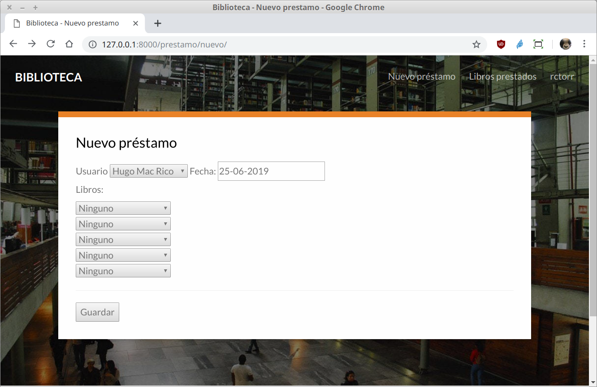

`Fullstack con Python` > [`Backend con Python`](../../Readme.md) > [`Sesión 04`](../Readme.md) > Ejemplo-04
## Definiendo y agregando una página con formulario a la aplicación web

### OBJETIVO
- Crear la ruta y vista para generar un formulario
- Crear la ruta y vista para procesar la información de un formulario vía POST.

### REQUISITOS
1. Actualizar repositorio
1. Usar la carpeta de trabajo `Sesion-04/Ejemplo-04`
1. Diagrama del modelo entidad-relación para el proyect __Biblioteca__

   

1. Documentación de Django referente a formularios:
   -

### DESARROLLO
Se agregará la opción al menú __Nuevo Préstamo__ que mostrará un formulario para agregar un nuevo prestamo al sistema, sin embago eso implica tener otra página con el formulario llamada `nuevo-prestamo.html`, como vamos a usar más de una página conviene crear una página de base y luego usarla para todas nuestras páginas.

1. Convertir la plantilla `index.html` en una página base y la página para el index.

   __Realizar una copia del archivo `index.html` y llamarla `base.html`:__

   ```console
   Ejemplo-04/Biblioteca $ cp catalogo/template/catalogo/index.html catalogo/template/base.html

   Ejemplo-04/Biblioteca $
   ```
   __Modificar el archivo `base.html` para que se vea similar a lo siguiente:__

   ```html
   ...
   <title>Biblioteca - Lista de libros prestados</title>
   ...
   <nav class="gtco-nav" role="navigation">
       <div class="gtco-container">
           <div class="row">
               <div class="col-sm-4 col-xs-12">
                   <div id="gtco-logo"><a href="/">Biblioteca</a></div>
               </div>
               <div class="col-xs-8 text-right menu-1">
                   <ul>
                       <li><a href="/prestamo/nuevo">Nuevo préstamo</a></li>
                       <li><a href="/">Libros prestados</a></li>
                       <li><a href="perfil.html">rctorr</a></li>
                   </ul>
               </div>
           </div>

       </div>
   </nav>
   ...
   <div class="tab-content-inner active" data-content="list">
       
       <h3>Lista de libros prestados</h3>
       <table class="table table-responsive table-hover table-striped ">
           <tr><th>Título</th><th>Fecha préstamo</th><th>Fecha devolución</th><th>Nombre</th></tr>
           
       <tr>
               <td>{{ r.titulo }}</td>
               <td>{{ r.fechaPre }}</td>
               <td>{{ r.fechaDev }}</td>
               <td>{{ r.nombre }}</td>
           </tr>
           
       </table>
       
   </div>
   ```
   Los cambios realizados son:
   - Se agrega la opción __Nuevo préstamos__ al menú
   - Se actualizan la url de las opciones del menú para respondan a las rutas de Django
   - Se hace uso de las etiquetas block de las plantillas de Django para hacer que ciertas parte del html puedan ser modificadas por otras páginas
   - Se definen dos bloques, __title__ y __contenido__ ambos podrán ser modificados por páginas hijas.

   __Ahora se modifica el archivo `index.html` para que se va de la siguiente forma:__

   ```html
   
   ```

1. En el menú ya tenemos la opción nuevo préstamo y al dar click aparece un error porque esa ruta no está definida, así que necesitamos agregar la ruta en el archivo `Biblioteca/catalogo/urls.py`:

   ```python
   urlpatterns = [
       path("", views.index, name="index"),
       path("prestamo/nuevo/", views.nuevo_prestamo, name="nuevo_prestamo"),
   ]
   ```

   __También toca agregar la vista correspondiente en el archivo `Biblioteca/catalogo/views.py`:__

   ```python
   def nuevo_prestamo(request):
       """ Vista para atender la petción de la url /prestamo/nuevo/ """
       # Inicialmente lo que queremos es ver el formulario
       return render(request, "catalogo/nuevo-prestamo.html")
   ```

   Después de esto deberías de ber algo similar a lo siguiente:

   
   ***

1. Tenemos un formulario ya funcionando, pero es estático, así que toca convertirlo a dinámico, por lo que modoficamos el archivo `Biblioteca/catalogo/templates/catalogo/nuevo-prestamo.html` de la siguiente manera:

   ```html
   <form method="POST">
       
       <aside>
       <label>Usuario</label>
       <select name="idUsuario">
           
           <option value="{{ u.id }}">{{ u }}</option>
           
       </select>
       <label>Fecha:</label>
       <input type="text" readonly value="{{ fecha }}">
       </aside>
       <aside class="libros">
           <label>Libros:</label><br />
           <select name="idLibro1">
               <option value="0">Ninguno</option>
               
               <option value="{{ l.id }}">{{ l }}</option>
               
           </select><br />
   ```

   Si actualizamos nuestra página se observará algo no muy bueno, así que primero modifiquemos la vista en el archivo `Biblioteca/catalogo/views.py`:

   ```python
   def nuevo_prestamo(request):
       """ Vista para atender la petción de la url /prestamo/nuevo/ """
       # Inicialmente lo que queremos es ver el formulario
       usuarios = Usuario.objects.all()
       fecha = datetime.date.today().strftime("%d-%m-%Y")
       libros = Libro.objects.all()

       return render(request, "catalogo/nuevo-prestamo.html",
           {
               "usuarios":usuarios,
               "fecha":fecha,
               "libros":libros
           }
       )
   ```
   El resultado debería ser algo similar a:

   

   Que es igual al que teníamos antes, pero este es generado de forma dinámica.

1. Ahora necesitamos procesar la petción __POST__ para lo cual necesitamos modificar la vista del formulario en el archiv `Biblioteca/catalogo/views.py`:

   ```python
   # Ahora queremos saber si hay o no petición POST primero
   if request.method == "POST":
       idUsuario = request.POST["idUsuario"]
       idUsuario = int(idUsuario)
       idLibro1 = request.POST["idLibro1"]
       idLibro2 = request.POST["idLibro2"]
       idLibro3 = request.POST["idLibro3"]
       idLibro4 = request.POST["idLibro4"]
       idLibro5 = request.POST["idLibro5"]

       usuario = Usuario.objects.get(pk=idUsuario)
       prestamo = Prestamo(usuario=usuario, fechaPre=datetime.date.today())
       prestamo.save()
       if idLibro1 is not "0":
           idLibro1 = int(idLibro1)
           libro1 = Libro.objects.get(pk=idLibro1)
           prestamo.libros.add(libro1)
       print(idLibro2)
       if idLibro2 is not "0":
           idLibro2 = int(idLibro2)
           libro2 = Libro.objects.get(pk=idLibro2)
           prestamo.libros.add(libro2)
       if idLibro3 is not "0":
           idLibro3 = int(idLibro3)
           libro3 = Libro.objects.get(pk=idLibro3)
           prestamo.libros.add(libro3)
       if idLibro4 is not "0":
           idLibro4 = int(idLibro4)
           libro4 = Libro.objects.get(pk=idLibro4)
           prestamo.libros.add(libro4)
       if idLibro5 is not "0":
           idLibro5 = int(idLibro5)
           libro5 = Libro.objects.get(pk=idLibro5)
           prestamo.libros.add(libro5)
       prestamo.save()
       msg = "Prestamo guardado con éxito!"
   else:
       msg = ""
   ```

   El resultado debería ser similar al siguiente:

   
