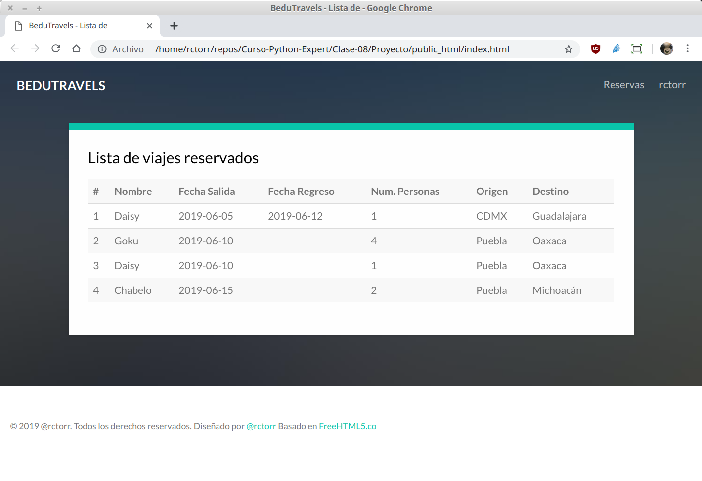
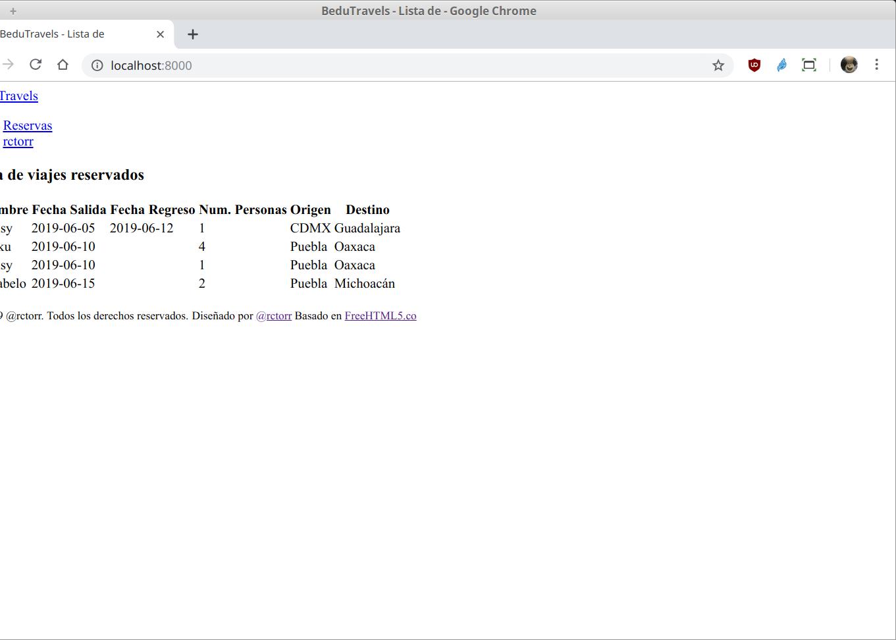

`Fullstack con Python` > [`Backend con Python`](../../Readme.md) > [`Sesión 04`](../Readme.md) > Proyecto
## Agregar la página de inicio ya maquetada a la aplicación web BeduTravels

### OBJETIVOS
- Agregar páginas ya maquetadas por medio de las plantillas con Django.
- Configurar y agregar los archivos estáticos en una aplicación web con Django.
- Contar con la página de inicio del proyecto BeduTravels disponible con Django.

#### REQUISITOS
1. Actualizar repositorio
1. Usar la carpeta de trabajo `Sesion-04/Proyecto/BeduTravels/`
1. Activar el entorno virtual __BeduTravels__
1. Página de inicio maquetada del proyecto __BeduTravels__

   

#### DESARROLLO
1. Ejecutar el proyecto __BeduTravels__ con:

   ```console
   (BeduTravels) Proyecto/BeduTravels $ python manage.py runserver
   [...]
   June 19, 2019 - 10:38:22
   Django version 2.2.2, using settings 'BeduTravels.settings'
   Starting development server at http://127.0.0.1:8000/
   Quit the server with CONTROL-C.   
   ```
   ***

1. Haciendo uso de las plantillas de Django integrar la página de inicio maquetada que se encuentra en `public_html/index.html`.

   __Crear las carpetas `BeduTravels/reservas/templates/reservas`:__

   ```console
   (BeduTravels) Proyecto/BeduTravels $ mkdir reservas/templates
   (BeduTravels) Proyecto/BeduTravels $ mkdir reservas/templates/reservas
   ```

   __Copiar el archivo `public_html/index.html` dentro de la carpeta `BeduTravels/reservas/templates/reservas/`:__

   ```console
   (BeduTravels) Proyecto/BeduTravels $ cp ../public_html/index.html reservas/templates/reservas/

   (BeduTravels) Proyecto/BeduTravels $ tree reservas/templates/
   reservas/templates/
   └── reservas
       └── index.html
   ```

   __Modificar la función `index()` en el archivo `reservas/views.py` para hacer uso de las plantillas (templates)__

   ```python
   from django.shortcuts import render

   # Create your views here.
   def index(request):
       """ Vista para atender la petición de la url / """
       return render(request, "reservas/index.html")
   ```
   Por omisión, Django busca los archivos html en la carpeta `proyecto/aplicacion/templates/aplicacion/`

   __El resultado en el navegador debería de ser el siguiente:__

   

   Hasta aquí ya podemos ver el html, pero ¿y los estilos y las imágenes?

   Como son archivos estáticos aún no hemos autorizado a que se puedan ver, así que continuemos.
   ***

1. Agregando acceso a los archivos estáticos (ruta y vista)

   __Crear la carpeta `BeduTravels/reservas/static/reservas/`:__

   ```console
   (BeduTravels) Proyecto/BeduTravels $ mkdir reservas/static
   (BeduTravels) Proyecto/BeduTravels $ mkdir reservas/static/reservas
   ```

   __Copiar las carpetas de los archivos estáticos (css, fonts, images y js):__

   ```console
   (BeduTravels) Proyecto/BeduTravels $ cp -a ../public_html/css reservas/static/reservas/

   (BeduTravels) Proyecto/BeduTravels $ cp -a ../public_html/fonts reservas/static/reservas/

   (BeduTravels) Proyecto/BeduTravels $ cp -a ../public_html/images reservas/static/reservas/

   (BeduTravels) Proyecto/BeduTravels $ cp -a ../public_html/js reservas/static/reservas/

   Sesion-04/Proyecto/BeduTravels $ tree -d 1 reservas/static/reservas/
   reservas/static/reservas/
   ├── css
   ├── fonts
   │   ├── bootstrap
   │   ├── icomoon
   │   └── themify-icons
   ├── images
   └── js
   ```

   __Finalmente hay que modificar la ruta en el archivo `index.html` para que usen el sistema de Django__

   Todas las url relativas o absolutas ahora tienen que ser absolutas e iniciar con `/static/reservas/`, uns ejemplos se muestra a continuación:

   ```html
   <!-- Animate.css -->
   <link rel="stylesheet" href="/static/reservas/css/animate.css">
   <!-- Icomoon Icon Fonts-->
   <link rel="stylesheet" href="/static/reservas/css/icomoon.css">
   ```
   Remplazar todas las coincidencias.

   __Actualizar el navegador y entonces se debería de ver la página mostrada al inicio__

   Si no funciona:
   - Recargar la página forzado actualizar el cache del navegador con `Control+Shift+R`.
   - En la ventana donde se está ejecutando el proyecto, deternlo y volver a iniciarlo.
   - Usar una ventana de incógnito.
   - Pedir ayuda a un experto (que no vas a encontrar en clase!)

   Si si funciona entonces:
   - Misión cumplida! Ya eres Django Baby!
