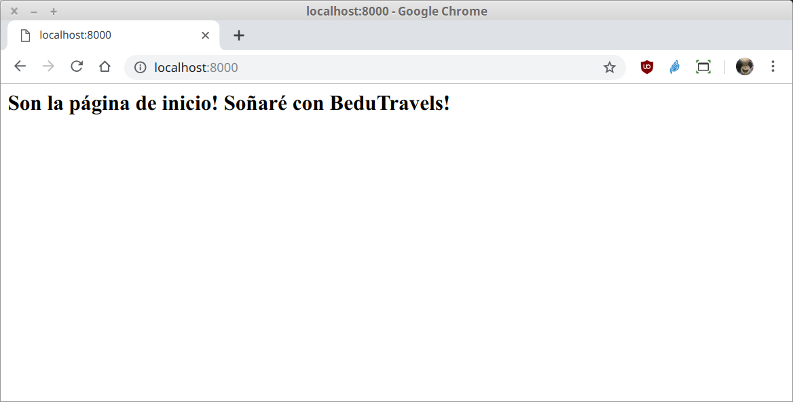

`Fullstack con Python` > [`Backend con Python`](../../Readme.md) > [`Sesión 04`](../Readme.md) > Reto-02
## Iniciar la construcción de la aplicación web BeduTravels con Django

### OBJETIVOS
- Crear el proyecto __BeduTravels__ con Django
- Crear la apicación __reservas__
- Definir la ruta / y su vista asociada

#### REQUISITOS
1. Actualizar repositorio
1. Usar la carpeta de trabajo `Sesion-04/Reto-02`
1. Activar el entorno virtual __BeduTravels__

#### DESARROLLO
1. Crear el proyecto __BeduTravels__ con Django y nos cambiamos a la carpeta del proyecto:

   ```console
   (BeduTravels) Reto-02 $ ???

   (BeduTravels) Reto-02 $ tree BeduTravels
   BeduTravels
   ├── BeduTravels
   │   ├── __init__.py
   │   ├── settings.py
   │   ├── urls.py
   │   └── wsgi.py
   └── manage.py

   (BeduTravels) Reto-02 $ cd BeduTravels

   (BeduTravels) Reto-02/BeduTravels $
   ```
   ***

1. Crear la aplicación __reservas__ con el comando:

   ```console
   (BeduTravels) Reto-02/BeduTravels $ python manage.py ???

   (BeduTravels) Reto-02/BeduTravels $ tree
   .
   ├── BeduTravels
   │   ├── __init__.py
   │   ├── settings.py
   │   ├── urls.py
   │   └── wsgi.py
   ├── reservas
   │   ├── admin.py
   │   ├── apps.py
   │   ├── __init__.py
   │   ├── migrations
   │   │   └── __init__.py
   │   ├── models.py
   │   ├── tests.py
   │   └── views.py
   └── manage.py
   ```
   ***

1. Ejecutar el proyecto __BeduTravels__ con:

   ```console
   (BeduTravels) Reto-02/BeduTravels $ python manage.py runserver
   Watching for file changes with StatReloader
   Performing system checks...

   System check identified no issues (0 silenced).

   You have 17 unapplied migration(s). Your project may not work properly until you apply the migrations for app(s): admin, auth, contenttypes, sessions.
   Run 'python manage.py migrate' to apply them.

   June 19, 2019 - 10:38:22
   Django version 2.2.2, using settings 'BeduTravels.settings'
   Starting development server at http://127.0.0.1:8000/
   Quit the server with CONTROL-C.   
   ```

   __Nota:__ Como el servidor bloquea la terminal, vamos a dejar esta terminal aquí y para los siguiente comandos abrir otra terminal, activar el entorno virtual BeduTravels y cambiarse a la carpeta de trabajo `Sesion-04/Reto-02/BeduTravels/`.

1. Agrega la aplicación __reservas__ a la configuración en el archivo `BeduTravels/BeduTravels/settings.py`:

   ```python
   # Application definition

   INSTALLED_APPS = [
       'django.contrib.admin',
       'django.contrib.auth',
       'django.contrib.contenttypes',
       'django.contrib.sessions',
       'django.contrib.messages',
       'django.contrib.staticfiles',
       'reservas',
   ]   
   ```

1. Mapear la url `/` con las rutas generales del proyecto __BeduTravels__ hacia las rutas de la aplicación __reservas__

   ```
   url / -> BeduTravels/BeduTravels/urls.py -> BeduTravels/reservas/urls.py
   ```

   __En el archivo `BeduTravels/BeduTravels/urls.py` agregar lo siguiente:__

   ```python
   from django.contrib import admin
   from django.urls import path, include  # modificada

   urlpatterns = [
       ???
       path('admin/', admin.site.urls),
   ]
   ```

   En la vetana donde se está ejecutando el proyecto __BeduTravels__ se puede observar el siguiente mensaje de error:

   ```console
   (BeduTravels) Reto-02/BeduTravels $ python manage.py runserver
   [...]
   File "<frozen importlib._bootstrap>", line 965, in _find_and_load_unlocked
   ModuleNotFoundError: No module named 'reservas.urls'
   ```
   Lo que indica que nos falta crear el archivo `urls.py` dentro de la carpeta `BeduTravels/reservas/`

1. Mapear la url `/` con las rutas de la aplicación __reservas__

   ```
   url / -> BeduTravels/reservas/urls.py -> BeduTravels/reservas/views.py
   ```

   __Crear el archivo `BeduTravels/reservas/urls.py` con el siguiente contenido:__

   ```python
   from django.urls import path
   from . import views

   urlpatterns = [
       ???,
   ]
   ```

   __Reiniciar Django para observar el resultado:__

   ```console
   [...]
   File "/home/rctorr/repos/Curso-Python-Expert/Sesion-04/Reto-02/BeduTravels/reservas/urls.py", line 5, in <module>
     path('', views.index, name='index'),
   AttributeError: module 'reservas.views' has no attribute 'index'
   ```
   Lo que indica que en el archivo `reservas/views.py` no existe una función llamada `index`, así que toca agregar dicha función.

1. Agregar la función/vista `index` al archivo `BeduTravels/reservas/views.py` con el siguiente contenido:

   ```python
   from django.http import HttpResponse
   from django.shortcuts import render

   # Create your views here.
   def index(request):
       """ Vista para atender la petición de la url / """
       ???
   ```

   __Nota: Si la aplicación Django no está iniciada, iniciarla en este momento y abrir la siguiente url en el navegador__

   http://127.0.0.1:8000

   __El resultado debería ser el siguiente:__

   
   ***
