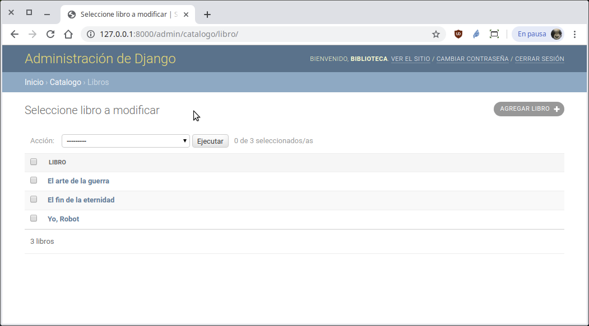
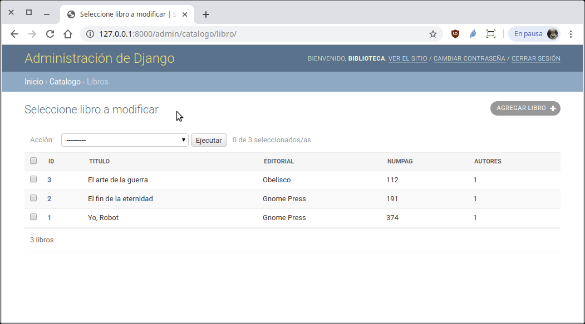

`Fullstack con Python` > [`Backend con Python`](../../Readme.md) > [`Sesión 09`](../Readme.md) > Reto-01
## Creando una tabla con el modelo de datos de Django

### OBJETIVO
- Crear una tabla con el modelo de datos con Django.
- Agregando el modelo al administrador de Django

#### REQUISITOS
1. Actualizar repositorio
1. Usar la carpeta de trabajo `Sesion-05/Reto-01`
1. Diagrama del modelo entidad-relación para el proyect __Biblioteca__

   

1. Documentación de Django referente a modelos:
   - Descripción de modelos y ejemplos: https://docs.djangoproject.com/en/2.2/topics/db/models/
   - Referencia a la API de Modelos en Django https://docs.djangoproject.com/en/2.2/ref/models/
   - Referencia a los tipos de datos que maneja Django https://docs.djangoproject.com/en/2.2/ref/models/fields/#field-types

#### DESARROLLO
1. Usando el modelo entidad-relación, crear la tabla Libro agregando el siguiente código el archivo `Biblioteca/catalogo/models.py`:

   ```python
   class Libro(models.Model):
       """ Define la tabla Libro """
       titulo = models.CharField(max_length=128)
       editorial = models.CharField(max_length=80)
       numPag = models.SmallIntegerField()
       autores = models.SmallIntegerField()
   ```

   __Avisando a Django que hemos modificado el archivo `models.py`:__

   ```console
   (Biblioteca) Reto-01/Biblioteca $ python manage.py makemigrations

   (Biblioteca) Reto-01/Biblioteca $ python manage.py migrate

   (Biblioteca) Reto-01/Biblioteca $
   ```

   __Agregando la tabla Libro al administrador de Django agregando las siguiente líneas al archivo `Biblioteca/catalogo/admin.py`:__

   ```python
   from django.contrib import admin
   from .models import Usuario, Libro

   # Register your models here.
   admin.site.register(Usuario)
   admin.site.register(Libro)
   ```
   Abrimos el navegador en la siguiente url ...

   Abrir la url http://localhost:8000/admin y usar los siguientes datos para entrar:
   - Usuario: biblioteca
   - Clave: biblioteca
   - Email: biblioteca@gmail.com

   __Se deberá de ver algo similar a la siguiente imagen después de agregar 3 libros:__

   

   ¿Podemos hacere algo para que el nombre del libro aparezca?
   ***

1. Modificando el modelo para Usuario y Libro para que aparezca el nombre o título según corresponda:

   ```python
   def __str__(self):
       """ Se define la representación en str para Usuario """
       return "{} {}".format(self.nombre, self.apellidos)   
   ```
   De forma similar para el modelo de Libro, con lo que se obtiene el siguiente resultado:

   
   ***

1. También se puede hacer que aparezcan los campos que uno necesite, agregando el siguiente código al archivo `Biblioteca/catalogo/admin.py`:

   ```python
   class UsuarioAdmin(admin.ModelAdmin):
       # Se sobre escribe lo que hace __str__
       list_display = ("id", "nombre", "apellidos", "edad", "genero")

   admin.site.register(Usuario, UsuarioAdmin)
   ```
   El resultado deberá ser similar al siguiente:

   
   
