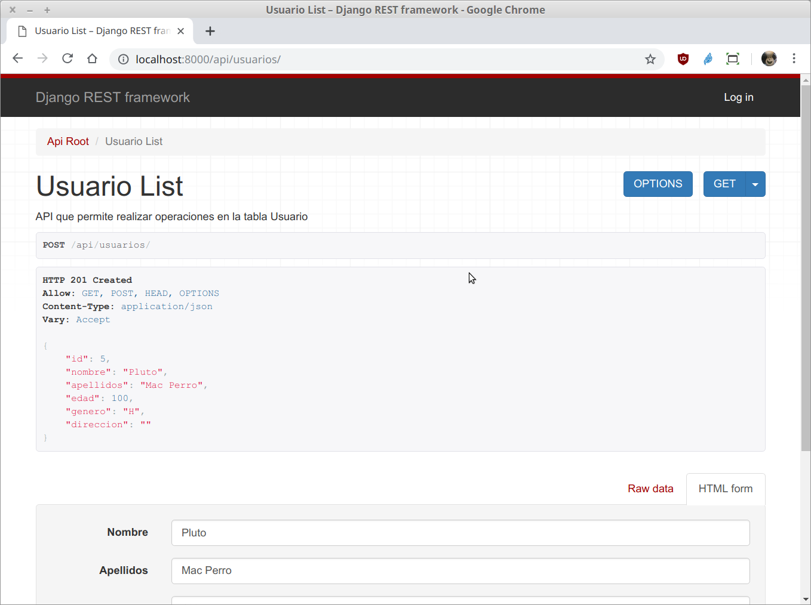

`Fullstack con Python` > [`Backend con Python`](../../Readme.md) > [`Sesión 06`](../Readme.md) > Ejemplo-02
## Creando un API para realizar las operaciones CRUD de una tabla tipo catálogo.

### OBJETIVOS
- Configurar Django Rest Framework
- Definir la url para el modelo __Usuario__ en el __API__
- Integrar Django Rest Framework en el proyecto Biblioteca
- Realizar operaciones de CRUD vía API

### REQUISITOS
1. Actualizar repositorio
1. Usar la carpeta de trabajo `Sesion-06/Ejemplo-02`
1. Activar el entorno virtual __Biblioteca__
1. Diagrama de entidad-relación del proyecto Biblioteca

   

### DESARROLLO
1. Agregando Django Rest Framework a la configuración en el archivo `settings.py` como una aplicación adicional:

   ```python
   INSTALLED_APPS = [
       'django.contrib.admin',
       'django.contrib.auth',
       'django.contrib.contenttypes',
       'django.contrib.sessions',
       'django.contrib.messages',
       'django.contrib.staticfiles',
       'catalogo',
       'rest_framework',
   ]
   ```
   ***

1. Se crea la ruta para la url `/api/usuarios` modificando el archivo `Biblioteca/catalogo/urls.py`:

   ```python
   # Imports
   from django.contrib.auth import views as auth_views
   from django.urls import path, include
   from rest_framework import routers

   from . import views

   # Agregando rutas para django rest
   router = routers.DefaultRouter()
   router.register(r'usuarios', views.UsuarioViewSet)
   [...]
   # Rutas para la url /api/
   path("api/", include(router.urls)),
   # Rutas para la autenticación url /api/auth/
   path("api/auth/", include("rest_framework.urls", namespace="rest_framework")),
   [...]
   ```
   ***

1. Se crea la vista para el api de la tabla __Usuario__ aunque en este caso en lugar de generar y regresar HTML será JSON.

   __Abrimos el archivo `Biblioteca/catalogo/views.py` y agregar el siguiente contenido:__

   ```python
   # Imports
   from django.contrib.auth import authenticate, login, logout
   from django.contrib.auth.decorators import login_required
   from django.shortcuts import render, redirect

   from .models import Usuario, Libro, Prestamo
   from .serializers import UsuarioSerializer

   from rest_framework import viewsets

   import datetime

   [...al final agregar...]
   # Vistas basadas en clases para Django Rest
   class UsuarioViewSet(viewsets.ModelViewSet):
      """
      API que permite realizar operaciones en la tabla Usuario
      """
      # Se define el conjunto de datos sobre el que va a operar la vista,
      # en este caso sobre todos los usuarios disponibles.
      queryset = Usuario.objects.all().order_by('id')
      # Se define el Serializador encargado de transformar la peticiones
      # en formato JSON a objetos de Django y de Django a JSON.
      serializer_class = UsuarioSerializer
   ```
   ***

1. Se crea el serializador `UsuarioSerializer` en el archivo `Biblioteca/catalogo/serializers.py`.

   ```python
   from rest_framework import serializers

   from .models import Usuario

   class UsuarioSerializer(serializers.HyperlinkedModelSerializer):
       """ Serializador para atender las conversiones para Usuario """
       class Meta:
           # Se define sobre que modelo actua
           model = Usuario
           # Se definen los campos a incluir
           fields = ('id', 'nombre', 'apellidos', 'edad', 'genero', 'direccion')
   ```
   ***

1. Acceso y uso de la __API__ `/api/usuarios`

   __Para tener acceso al API abrir la siguiente url:__

   http://localhost:8000/api/usuarios/

   Se deberá de observar algo similar a lo siguiente:

   

   __Agregando un nuevo usuario vía web:__

   

   

   __Agregando un nuevo usuario vía consola:__

   ```console
   (Biblioteca) Ejemplo-02 $ curl -d '{"nombre": "Donald", "apellidos": "Mac Pato", "edad": 101, "genero": "H", "direccion": ""}' -H 'Content-Type: application/json' http://localhost:8000/api/usuarios/
   {"id":6,"nombre":"Donald","apellidos":"Mac Pato","edad":101,"genero":"H","direccion":""}
   (Biblioteca) Ejemplo-02 $
   ```
   Notar que esto genera una petición POST y como resultado se obtiene el usuario agregado con el id asignado.

   También se puede verificar actualizando la lista de usuarios en la vista del api del navegador.

   __Eliminando el usuario Pluto vía consola:__

   ```console
   (Biblioteca) Ejemplo-02 $ curl -X DELETE http://localhost:8000/api/usuarios/5/

   (Biblioteca) Ejemplo-02 $
   ```
   Sin más el usuario se elimina y se puede verificar en la vista web.
