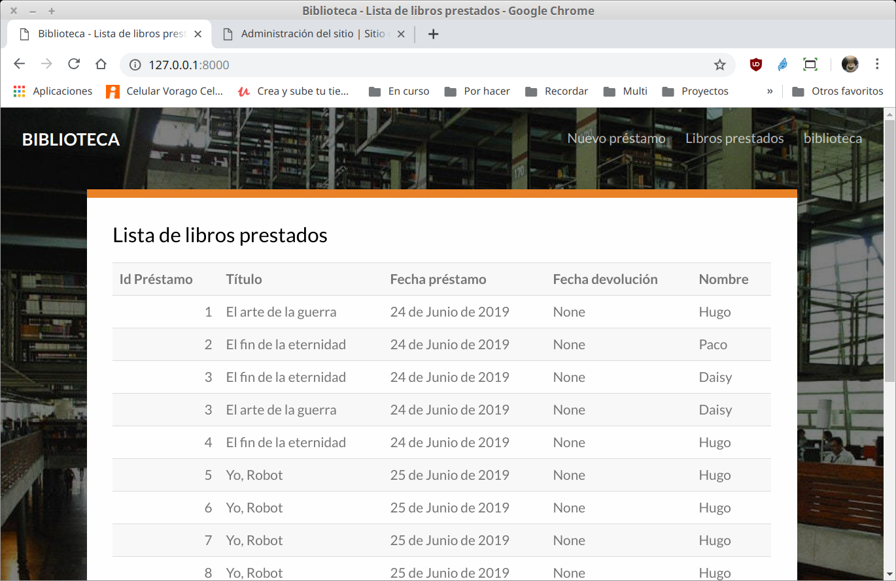

`Fullstack con Python` > [`Backend con Python`](../../Readme.md) > [`Sesión 10`](../Readme.md) > Proyecto
## Definiendo elementos necesarios para otorgar permisos para eliminar datos.  

### OBJETIVO
- Crear la ruta y vista para eliminar un registro de uno o más modelos.
- Definir permisos en base a grupos para la eliminación de registros.

### REQUISITOS
1. Actualizar repositorio
1. Usar la carpeta de trabajo `Clase-10/Proyecto`
1. Los requerimientos consisten en que en base al maquetado de la página web de inicio mostrado en la imagen, realizar lo siguiente:
   - La opción para borrar un registro sólo aparece si el usuario pertenece al grupo __eliminar__
   - En cuando se dé click en la opción eliminar, aparecerá un diálogo para verificar si se elimina o no el registro, contando con las opciones de __Cancelar__ o __Eliminar__.
   - Si se elige __Eliminar__ se hará una llamada a la url `/prestamo/idPrestamo/libros/elimina/idLibro/` para eliminar el libro del préstamo seleccionado.
   - Se redirecciona a la página de inicio

   

### DESARROLLO
1. El primer paso es completar la información de la tabla, así que se necesita el `id` de los modelos __Prestamo__ y __Libro__ por lo que se necesita modificar el archivo `Biblioteca/catalogo/views.py` para enviar a la plantilla index.html los datos mencionados:

   ```python
   # Create your views here.
   def index(request):
       """ Vista para atender la petción de la url / """
       # Obteniendo los datos mediantes consultas
       prestamos = Prestamo.objects.all()

       return render(request, "catalogo/index.html", {"prestamos":prestamos})

   ```
   En lugar de crear los registros a mano, mejor se envía la lista de préstamos, ya que cada préstamo está relacionado con su usuario y además con los libros asociados a ese préstamo, dejaremos que la plantilla en HTML haga el resto.

   __Modificando la plantilla `index.html` para hacer uso de la variable `prestamos` y obtener los datos faltantes:__

   ```html
   
   
   <tr>
       <td class="text-right">{{ p.id }}</td>
       <td>{{ l.titulo }}</td>
       <td>{{ p.fechaPre }}</td>
       <td>{{ p.fechaDev }}</td>
       <td>{{ p.usuario.nombre }}</td>
       <td class="acciones">
           <a data-toggle="modal" data-target="#eliminaModal"
               data-url="/prestamo/{{ p.id }}/libros/elimia/{{ l.id }}/">
               <i class="icon-cross"></i>
           </a>
       </td>
   </tr>
   
   
   ```
   Es importante comentar que aunque algunas instrucciones como if y for de Python se pueden ejecutar en las plantillas, la finalidad de estas instrucciones es automatizar la creación de la presentación o plantilla o código HTML y no está pensando para crear la lógica de negocio.

1. Después de las modificaciones anteriores ahora cada libro de cada préstamo tiene la acción para poder ser eliminado usando una url `/prestamo/idPrestamo/libros/elimina/idLibro/` por lo que se tiene que crear la ruta y vistas respectivas:

   __Creando la ruta para atender la url mencionada por lo que se agrega el siguiente código al archivo `Biblioteca/catalogo/urls.py`__

   ```python
   path("prestamo/<int:idPrestamo>/libros/elimina/<int:idLibro>/",
       views.elimina_libros_prestamo, name="elimina_libros_prestamo"),
   ```
   Notas como el sistema de rutas de Django nos permite agregar variables en las url's y además indicar el tipo de dato. Ver https://docs.djangoproject.com/en/2.2/topics/http/urls/

   __Creando la vista correspondiente en el archivo `Biblioteca/catalogo/views.py`:__

   ```python
   @login_required()
   def elimina_libros_prestamo(request, idPrestamo, idLibro):
       """
       Atiende la petición GET
          /prestamo/<int:idPrestamo>/libros/elimina/<int:idLibro>/
       """
       # Se obtienen los objetos correspondientes a los id's
       prestamo = Prestamo.objects.get(pk=idPrestamo)
       libro = Libro.objects.get(pk=idLibro)

       # Se elimina el libro del préstamo
       prestamo.libros.remove(libro)

       return redirect("/")
   ```
   Notar que la vista incluye del decorador `@login_required()` ya que no cualquiera puede eliminar un libro de un préstamo, así que ahora agregaremos los permisos usando el grupo __eliminar__.

1. Crear el grupo usando el __Administrador de Django__:

   

   

1. Se modifica la plantilla para que muestre sólo las opciones de eliminar cuando el usuario pertenezca al grupo __eliminar__.

   ```html
   
   <th>Acciones</th>
   
   [...]
   
   <td class="acciones">
       <a data-toggle="modal" data-target="#eliminaModal"
           data-url="/prestamo/{{ p.id }}/libros/elimina/{{ l.id }}/">
           <i class="icon-cross"></i>
       </a>
   </td>
   
   [...]
   ```

   __Se modifica la vista `index()` para que agregre la variable grupos al contexto__

   ```python
   def index(request):
       """ Vista para atender la petción de la url / """
       # Obteniendo los datos mediantes consultas
       prestamos = Prestamo.objects.all()
       grupos = request.user.groups.values_list("name", flat=True)

       return render(request, "catalogo/index.html",
           {"prestamos":prestamos, "grupos":grupos}
       )
   ```

   __Se modifica la vista `elimina_libros_prestamo()` para que valide que el usuario pertenece al grupo eliminar__

   ```python
   # Se valida que el usuario pertenezca al grupo eliminar
   grupos = request.user.groups.values_list("name", flat=True)
   if "eliminar" in grupos:
       # Se obtienen los objetos correspondientes a los id's
       prestamo = Prestamo.objects.get(pk=idPrestamo)
       libro = Libro.objects.get(pk=idLibro)

       # Se elimina el libro del préstamo
       prestamo.libros.remove(libro)
   ```
   Ahora ya se pueden comprobar algunos resultados ...

   __RESULTADOS__

   __Caso página de inicio sin usuario__

   
   Notar que no se muestra la columna de acciones

   __Caso página de inicio con usuario biblioteca__

   
   Notar que a presar de que se está usando el usuario biblioteca, la columna de acciones no apaece y esto es debido a que el usuario no pertenece al grupo __eliminar__.

   __Caso página de inicio con usuario biblioteca agregado al grupo eliminar__

   
   Usando el administrador de Django se agrega el grupo __eliminar__ al usuario __biblioteca__.

   
   En este caso ya se muestra la columna de __Acciones__ que permite eliminar cada registro.
