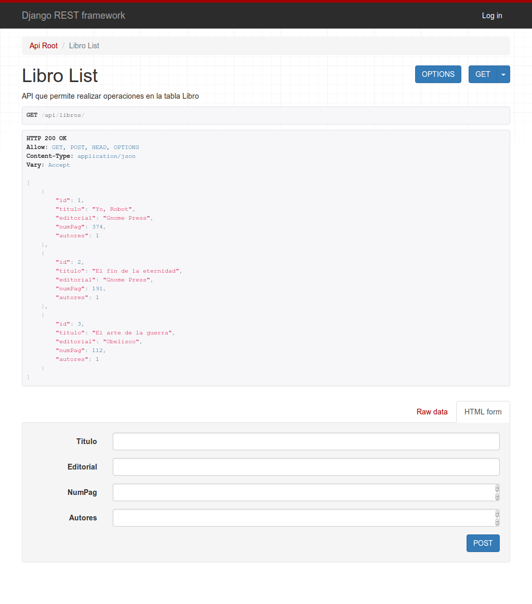
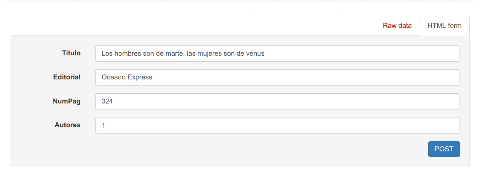

`Fullstack con Python` > [`Backend con Python`](../../Readme.md) > [`Sesión 06`](../Readme.md) > Reto-02
## Creando un API para realizar las operaciones CRUD de una tabla tipo catálogo.

### OBJETIVOS
- Agregar el modelo __Libro__ a el __API__ de la Biblioteca
- Realizar operaciones de CRUD vía API para la tabla __Libro__

### REQUISITOS
1. Actualizar repositorio
1. Usar la carpeta de trabajo `Sesion-06/Reto-02`
1. Activar el entorno virtual __Biblioteca__
1. Diagrama de entidad-relación del proyecto Biblioteca

   

### DESARROLLO
1. Se crea la ruta para la url `/api/libros` modificando el archivo `Biblioteca/catalogo/urls.py`:

   ```python
   router.register(r'libros', views.LibroViewSet)
   ```
   ***

1. Se crea la vista para el api de la tabla __Libro__ aunque en este caso en lugar de generar y regresar HTML será JSON.

   __Abrimos el archivo `Biblioteca/catalogo/views.py` y agregar el siguiente contenido:__

   ```python
   from .serializers import UsuarioSerializer, LibroSerializer

   [...al final agregar...]
   class LibroViewSet(viewsets.ModelViewSet):
      """
      API que permite realizar operaciones en la tabla Libro
      """
      # Se define el conjunto de datos sobre el que va a operar la vista,
      # en este caso sobre todos los libros disponibles.
      queryset = Libro.objects.all().order_by('id')
      # Se define el Serializador encargado de transformar la peticiones
      # en formato JSON a objetos de Django y de Django a JSON.
      serializer_class = LibroSerializer
   ```
   ***

1. Se crea el serializador `LibroSerializer` en el archivo `Biblioteca/catalogo/serializers.py`.

   ```python
   from .models import Usuario, Libro

   class LibroSerializer(serializers.HyperlinkedModelSerializer):
       """ Serializador para atender las conversiones para Libro """
       class Meta:
           # Se define sobre que modelo actua
           model = Libro
           # Se definen los campos a incluir
           fields = ('id', 'titulo', 'editorial', 'numPag', 'autores')
   ```
   ***

1. Acceso y uso de la __API__ `/api/libros`

   __Para tener acceso al API abrir la siguiente url:__

   http://localhost:8000/api/libros/

   Se deberá de observar algo similar a lo siguiente:

   

   __Agregando un nuevo libro vía web:__

   

   

   __Eliminando el usuario agregado vía consola:__

   ```console
   (Biblioteca) Reto-02 $ curl -X DELETE http://localhost:8000/api/libros/4/

   (Biblioteca) Reto-02 $
   ```
   Sin más el usuario se elimina y se puede verificar en la vista web.
