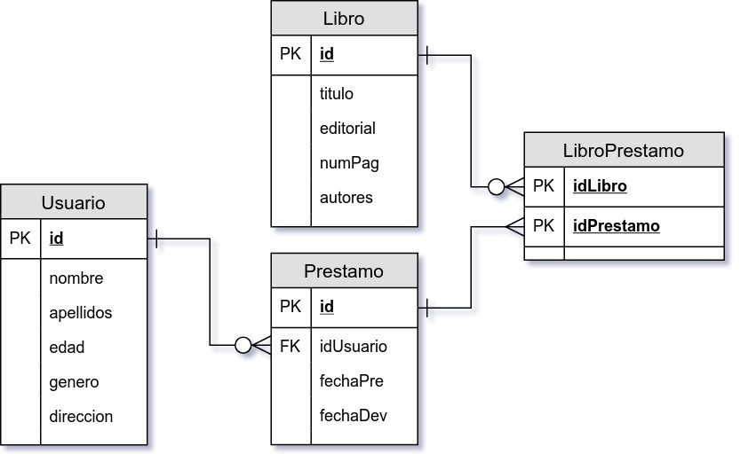
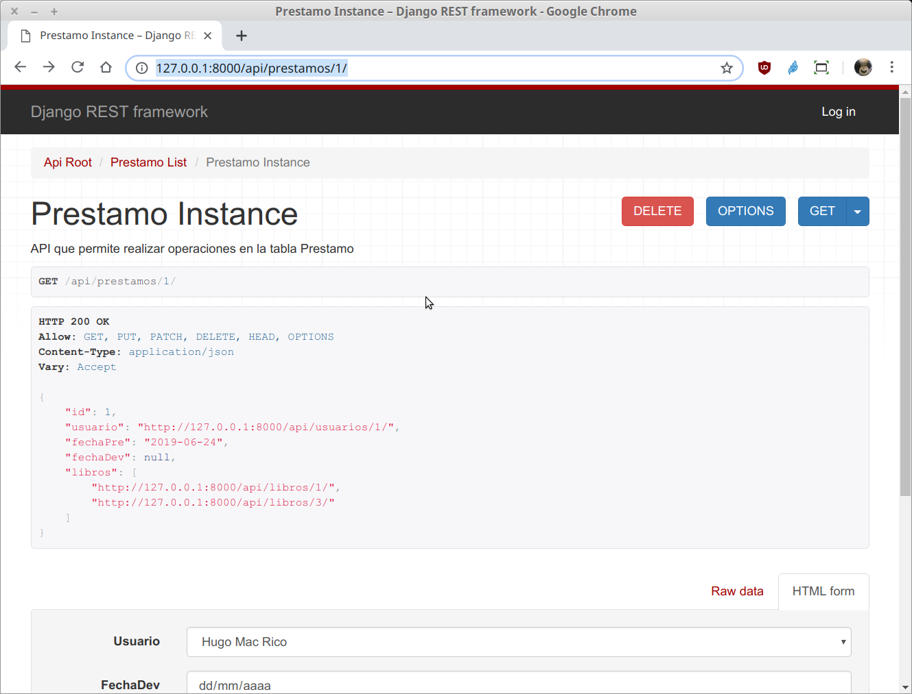
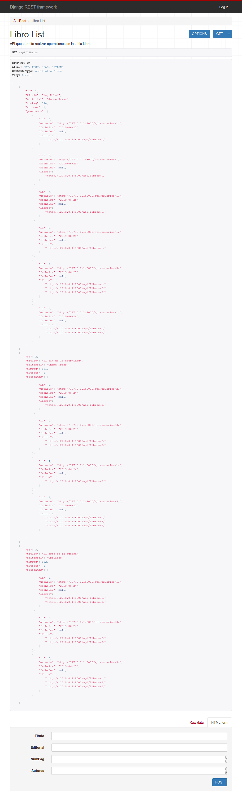

`Fullstack con Python` > [`Backend con Python`](../../Readme.md) > [`Sesión 11`](../Readme.md) > Proyecto
## Creando un API para realizar las operaciones CRUD de una tabla con relaciones muchos a muchos.

### OBJETIVOS
- Agregar la relación muchos a muchos entre los modelos __Prestamo__ y __Libro__.
- Realizar operaciones de CRUD vía API para la tabla __Prestamo__ incluyendo los libros asociados.

### REQUISITOS
1. Actualizar repositorio
1. Usar la carpeta de trabajo `Sesion-07/Proyecto`
1. Activar el entorno virtual __Biblioteca__
1. Diagrama de entidad-relación del proyecto Biblioteca

   

### DESARROLLO
1. Se actualiza el serializador `PrestamoSerializer` en el archivo `Biblioteca/catalogo/serializers.py` para agregar el campo `libros` para que muestre la lista de libros por cada préstamo:

   ```python
           # Se definen los campos a incluir
           fields = ('id', 'usuario', 'fechaPre', 'fechaDev', 'libros')
   ```
   ***

1. Acceso y uso de la __API__ `/api/prestamos`

   __Para tener acceso al API abrir la siguiente url:__

   http://localhost:8000/api/prestamos/

   Se deberá de observar algo similar a lo siguiente:

   

   __Para tener acceso al detalle del prestamo con id=1 abrir la siguiente url:__

   http://localhost:8000/api/prestamos/1/

   Se deberá de observar algo similar a lo siguiente:

   
   ***

1. Ahora se modifica nuevamente el archivo `serializers.py` para que se muestre la lista de préstamos por cada libro.

   ```python
   class LibroSerializer(serializers.HyperlinkedModelSerializer):
      """ Serializador para atender las conversiones para Libro """

      # Se define la relación muchos a muchos entre Libro y Prestamo
      prestamos = PrestamoSerializer(many=True, read_only=True)
      class Meta:
          # Se define sobre que modelo actua
          model = Libro
          # Se definen los campos a incluir
          fields = ('id', 'titulo', 'editorial', 'numPag', 'autores', 'prestamos')
   ```

   __Se actualiza el modelo Prestamo para incluir el reverso para ir de Libro a Prestamo:__

   ```python
   class Prestamo(models.Model):
       """ Define la tabla Prestamo """
       usuario = models.ForeignKey(Usuario, on_delete=models.CASCADE, related_name="prestamos")
       fechaPre = models.DateField(auto_now_add=True)
       fechaDev = models.DateField(null=True, blank=True)
       libros = models.ManyToManyField(Libro, related_name="prestamos")
   ```

   __El resultado debe ser como el siguiente:__

   
   
