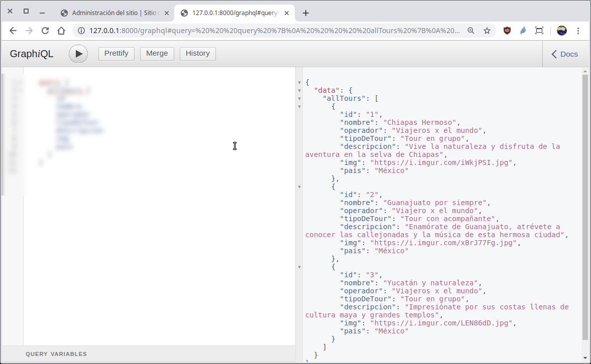
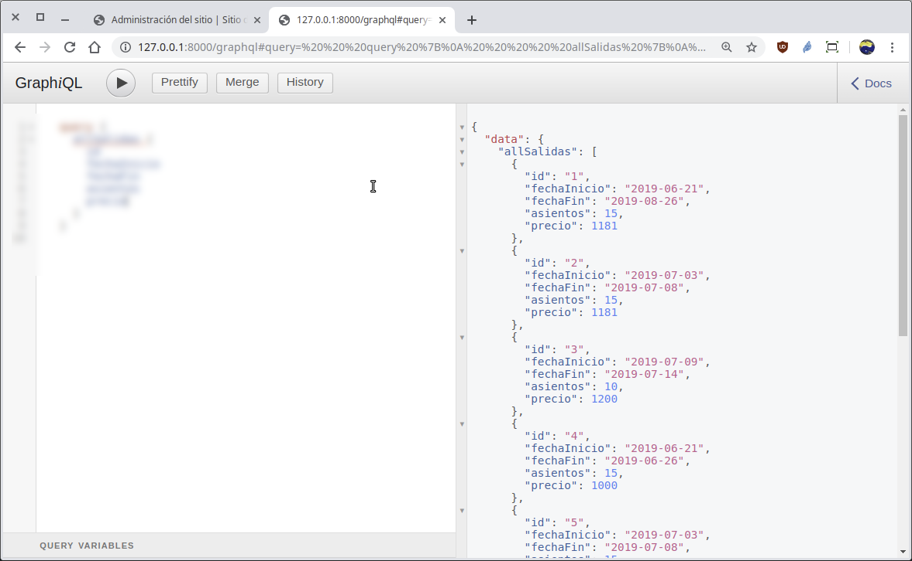
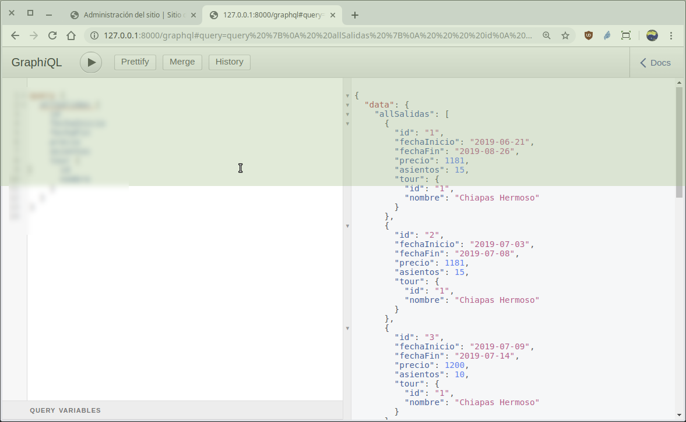
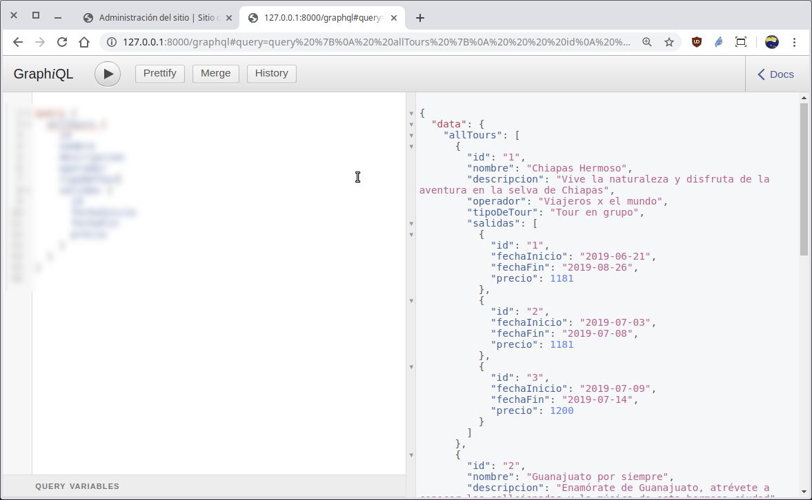
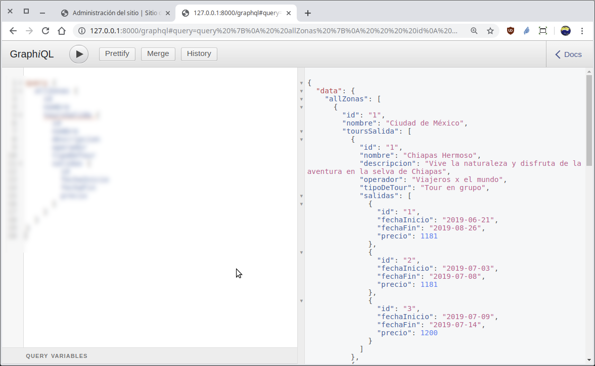

[`Backend con Python`](../../Readme.md) > [`Sesión 07`](../Readme.md) > Reto-02
## Definiendo esquemas para crear un API GraphQL y realizar consultas de datos

### OBJETIVOS
- Definir el esquemas para modelos de Django
- Realizar operaciones de consulta vía __API GraphQL__ a modelos simples
- Realizar operaciones de consulta a modelos con relaciones

### REQUISITOS
1. Actualizar repositorio
1. Usar la carpeta de trabajo `Sesion-07/Reto-02`
1. Activar el entorno virtual __Bedutravels__
1. Diagrama de entidad-relación del proyecto Bedutravels
   

### DESARROLLO
1. Se crea la ruta para la url `/graphql` modificando el archivo `Bedutravels/tours/urls.py`.

   Debido a que GraphQL sólo necesita un punto de entrada, no es necesario estar creando o adicionando más rutas, así que puedes continuar.
   ***

1. Crear el esquema (schema) en el archivo `Bedutravels/tours/schema.py` para atender las consultas que obtiene la lista de todos los registros de los modelos __Tour__ y __Salidas__

   Se necesitan los tipos __TourType__ y __SalidasType__:

   ```python
   class TourType(DjangoObjectType):
       """ Tipo de dato para manejar el tipo Tour """
       ???

   class SalidaType(DjangoObjectType):
       """ Tipo de dato para manejar el tipo Salida """
       ???
   ```

   Después se agregan las variables para cada tipo de campo nuevo y la función que atenderá las consultas:

   ```python
   # Se definen los posibles campos en las consultas
   [...]
   all_tours = ???  # allTours
   all_salidas = ???  # allSalidas
   [...]
   def resolve_all_tours(self, info, **kwargs):
       # Responde con la lista de todos registros
       ???

   def resolve_all_salidas(self, info, **kwargs):
       # Responde con la lista de todos registros
       ???
   ```
   ***

1. Acceso y uso de la __API__ `/graphql` a sólo una tabla

   __Para tener acceso al API abrir la siguiente url:__

   http://localhost:8000/graphql

   __Obteniendo la lista de todos los registros del modelo Tour:__

   Escribir la siquiente consulta en formato __GraphQL__ y ejecutar la consulta:

   ```json
   query {
     ???
   }   
   ```
   el resultado deberá ser similar al siguiente:

   

   __Obteniendo la lista de todos los registros del modelo Salida:__

   ```json
   query {
     ???
   }   
   ```
   El resultado será similar a:

   
   ***

1. Acceso y uso de la __API__ `/graphql` a tablas con relaciones

   __El acceso al API sigue siendo el mismo:__

   http://localhost:8000/graphql

   __Obtener la lista de todas las salidas y su tour relacionado (ver diagrama del modelo-er):__

   La consulta en GraphQL es:

   ```json
   query {
     allSalidas {
       id
       fechaInicio
       fechaFin
       precio
       asientos
       ???
     }
   }   
   ```
   El resultado deberá ser similar a:
   

   __Obtener la lista de todos los tours y su lista de salidas relacionado:__

   Para hacer esta consulta más simple, se recomienda realizar la siguiente modificación al archivo `Bedutravels/tours/models.py`:

   ```python
   class Salida(models.Model):
       [...]
       tour = models.ForeignKey(Tour, related_name="salidas", on_delete=models.CASCADE)
   ```
   Consiste en agregar el parámetro `related_name` que es como si se agregara un atributo al modelo __Tour__ quedando como `Tour.salidas` y nos permitirá mostrar todas las salidas para cada Tour.

   La consulta en GraphQL es:

   ```json
   query {
     allTours {
       id
       nombre
       descripcion
       operador
       tipoDeTour
       ???
     }
   }   
   ```
   El resultado deberá ser similar a:
   

   __Obtener la lista de todas las Zonas con todos los Tours de salida para cada zona y con todas las Salidas para cada Tour:__

   Para hacer esta consulta más simple, se recomienda realizar la siguiente modificación al archivo `Bedutravels/tours/models.py`:

   ```python
   class Tour(models.Model):
       [...]
       zonaSalida = models.ForeignKey(Zona, on_delete=models.SET_NULL, null=True,
           blank=True, related_name="tours_salida")
       zonaLlegada = models.ForeignKey(Zona, on_delete=models.SET_NULL, null=True,
           blank=True, related_name="tours_llegada")
   ```
   Consiste en modificar el parámetro `related_name` para que el acceso de los Tours desde las Zonas sea más simple.

   La consulta en GraphQL es:

   ```json
   query {
     ???
   }   
   ```
   El resultado deberá ser similar a:
   
