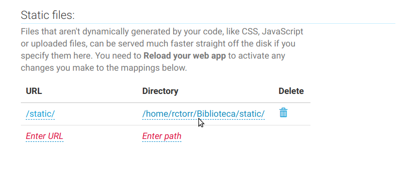
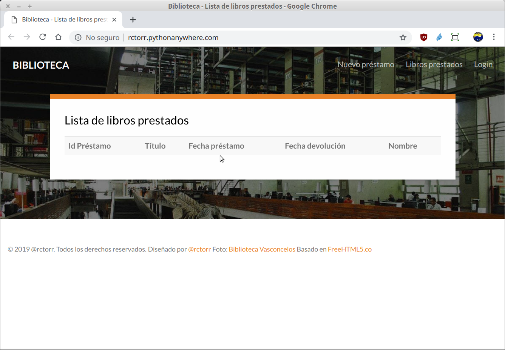
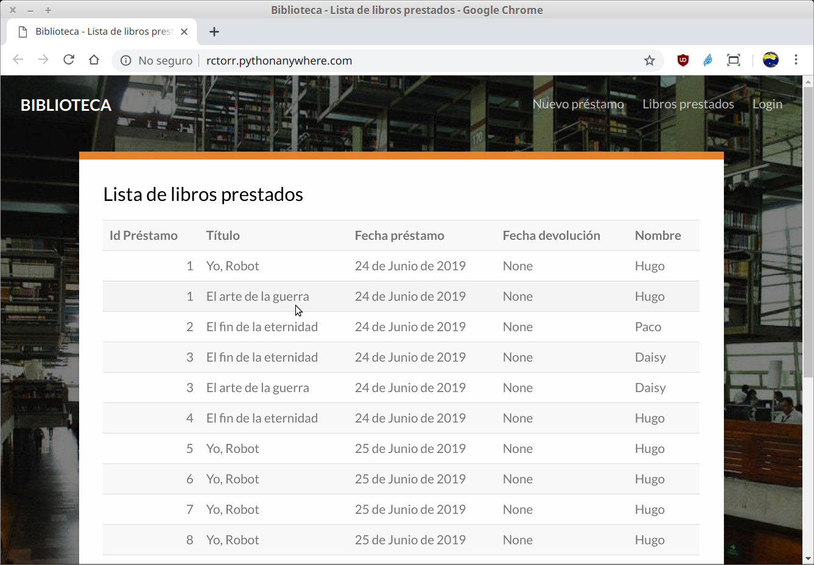

`Fullstack con Python` > [`Backend con Python`](../../Readme.md) > [`Sesión 08`](../Readme.md) > Ejemplo-04
## Archivos estáticos y base de datos en producción

### OBJETIVOS
- Preparar el entorno de producción para los archivos estáticos
- Configurar la base de datos en producción

### REQUISITOS
1. Actualizar repositorio __CursoPythonBedu__
1. La carpeta de referencia es `Sesion-08/Ejemplo-04/Biblioteca/`
1. Contar con repo __Biblioteca__ en equipo local
1. La carpeta de trabajo debe ser `Biblioteca/`
1. Contar con repo __Biblioteca__ en Github
1. Contar con repo __Biblioteca__ en Pythonanywhere
1. Contar con el proyecto ya configurado en Pythonanywhere

### DESARROLLO
1. Nuestra aplicación en producción actualmente se ve sin estilos y para corregir esto en la carpeta `Biblioteca/` en el equipo local agregar el siguiente código al archivo `Biblioteca/Biblioteca/settings-prod.py`:

   ```python
   STATIC_ROOT = os.path.join(BASE_DIR, "static")
   ```

   __Agregar el cambio a repo local con:__
   ```console
   Biblioteca $ git add Biblioteca/settings-prod.py
   Biblioteca $ git commit -m "Agregando variable STATIC_ROOT a settings-prod.py"
   [master 24fa423] Agregando variable STATIC_ROOT a settings-prod.py
   1 file changed, 1 insertion(+)
   Biblioteca $
   ```

   __Actualizando el repo en github con:__
   ```console
   Biblioteca $ git push
   Username for 'https://github.com': tu-usuario
   Password for 'https://rctorr@github.com':
   Counting objects: 4, done.
   Delta compression using up to 4 threads.
   Compressing objects: 100% (4/4), done.
   Writing objects: 100% (4/4), 408 bytes | 0 bytes/s, done.
   Total 4 (delta 3), reused 0 (delta 0)
   remote: Resolving deltas: 100% (3/3), completed with 3 local objects.
   To https://github.com/rctorr/Biblioteca.git
      d3d73e1..24fa423  master -> master

   Biblioteca $
   ```

   __Actualizando el repo en Pythonanywhere en un consola bash:__
   ```console
   (Biblioteca) 20:34 ~/Biblioteca (master)$ git pull                                               remote: Enumerating objects: 7, done.
   remote: Counting objects: 100% (7/7), done.
   remote: Compressing objects: 100% (1/1), done.
   remote: Total 4 (delta 3), reused 4 (delta 3), pack-reused 0
   Unpacking objects: 100% (4/4), done.                                              From https://github.com/rctorr/Biblioteca
    d3d73e1..24fa423  master     -> origin/master
   Updating d3d73e1..24fa423                                       
   Fast-forward                                                           Biblioteca/settings-prod.py | 1 +               
     1 file changed, 1 insertion(+)                               
   (Biblioteca) 20:38 ~/Biblioteca (master)$
   ```

   __En Pythonanywhere se crea la carpeta `Biblioteca/static` y se actualizan los archivos estáticos:__
   ```console
   (Biblioteca) 20:51 ~/Biblioteca (master)$ mkdir static
   (Biblioteca) 20:51 ~/Biblioteca (master)$ python manage.py collectstatic

   195 static files copied to '/home/rctorr/Biblioteca/static'.
   (Biblioteca) 20:52 ~/Biblioteca (master)$
   ```

   __En Pythonanywhere en Dashboard - Web sección Static se agregar la ruta para los archivos estáticos:__

   

   __Recargar la aplicación dando click en reload en el Dashboard - Web__

   Y finalmente actualiza la página en el navegador y el resultado debería ser similar al siguiente:
   

1. La base de datos a usar en producción es MySQL con los datos obtenidos anteriormente, se configuran en el archivo `Biblioteca/Biblioteca/settings-prod.py` en la sección de base de datos quedando de la siguiente forma:

   ```python
   # Database
   # https://docs.djangoproject.com/en/2.2/ref/settings/#databases

   DATABASES = {
       'default': {
           'ENGINE': 'django.db.backends.mysql',
           'NAME': 'rctorr$Biblioteca',
           'USER': 'rctorr',
           'PASSWORD': 'pythonsql',
           'HOST': 'rctorr.mysql.pythonanywhere-services.com',
       }
   }   
   ```

   __Nuevamente se realizar el proceso de actualizar el repo local, el repo en github:__

   ```console
   Biblioteca $ git add Biblioteca/settings-prod.py
   Biblioteca $ git commit -m "Agregando configuración para hacer uso de MySQL como base de datos en settings-prod.py"
   [master b1026f1] Agregando configuración para hacer uso de MySQL como base de datos en settings-prod.py
    1 file changed, 5 insertions(+), 2 deletions(-)

   Biblioteca $ git push
   Username for 'https://github.com': rctorr
   Password for 'https://rctorr@github.com':
   Counting objects: 4, done.
   Delta compression using up to 4 threads.
   Compressing objects: 100% (4/4), done.
   Writing objects: 100% (4/4), 507 bytes | 0 bytes/s, done.
   Total 4 (delta 3), reused 0 (delta 0)
   remote: Resolving deltas: 100% (3/3), completed with 3 local objects.
   To https://github.com/rctorr/Biblioteca.git
      24fa423..b1026f1  master -> master
   ```

   __Actualizando el repo en producción:__
   ```console
   (Biblioteca) 21:37 ~/Biblioteca (master)$ git pull    
   remote: Enumerating objects: 7, done.
   remote: Counting objects: 100% (7/7), done.
   remote: Compressing objects: 100% (1/1), done.
   remote: Total 4 (delta 3), reused 4 (delta 3), pack-reused 0
   Unpacking objects: 100% (4/4), done.                   
   From https://github.com/rctorr/Biblioteca
      24fa423..b1026f1  master     -> origin/master
   Updating 24fa423..b1026f1
   Fast-forward
    Biblioteca/settings-prod.py | 7 +++++--
    1 file changed, 5 insertions(+), 2 deletions(-)

   (Biblioteca) 21:37 ~/Biblioteca (master)$
   ```

   Como se ha configurado la base de datos MySQL para producción por lo que se necesitará el módulo correspondiente para que Django pueda realizar la conexión:

   ```console
   (Biblioteca) 21:37 ~/Biblioteca (master)$ pip install mysqlclient
   Looking in links: /usr/share/pip-wheels
   Collecting mysqlclient
     Downloading https://files.pythonhosted.org/packages/f4/f1/3bb6f64ca7a429729413e6556b7ba5976df06019a5245a43d36032f1
   061e/mysqlclient-1.4.2.post1.tar.gz (85kB)
        |████████████████████████████████| 92kB 3.0MB/s
   Building wheels for collected packages: mysqlclient
     Building wheel for mysqlclient (setup.py) ... done
     Created wheel for mysqlclient: filename=mysqlclient-1.4.2.post1-cp37-cp37m-linux_x86_64.whl size=97680 sha256=ef87
   85eae5003285fc98d4bc24f2b211eeebe85cf0c99795550c2c1a2118fad6
     Stored in directory: /home/rctorr/.cache/pip/wheels/30/91/e0/2ee952bce05b1247807405c6710c6130e49468a5240ae27134
   Successfully built mysqlclient
   Installing collected packages: mysqlclient
   Successfully installed mysqlclient-1.4.2.post1

   (Biblioteca) 21:37 ~/Biblioteca (master)$
   ```

   Como tenemos una nueva base de datos, ésta está vacía por lo que hay que aplicar las migraciones en producción y luego crear el usuario administrador de nuestra aplicación.
   ```console
   (Biblioteca) 21:37 ~/Biblioteca (master)$ python manage.py migrate
   System check identified some issues:

   WARNINGS:
   ?: (mysql.W002) MySQL Strict Mode is not set for database connection 'default'
   HINT: MySQL's Strict Mode fixes many data integrity problems in MySQL, such as data truncation upon insertio
   n, by escalating warnings into errors. It is strongly recommended you activate it. See: https://docs.djangoproject.c
   om/en/2.2/ref/databases/#mysql-sql-mode
   Operations to perform:
   Apply all migrations: admin, auth, catalogo, contenttypes, sessions
   Running migrations:
   Applying contenttypes.0001_initial... OK
   Applying auth.0001_initial... OK
   Applying admin.0001_initial... OK
   Applying admin.0002_logentry_remove_auto_add... OK
   Applying admin.0003_logentry_add_action_flag_choices... OK
   Applying contenttypes.0002_remove_content_type_name... OK
   Applying auth.0002_alter_permission_name_max_length... OK
   Applying auth.0003_alter_user_email_max_length... OK
   Applying auth.0004_alter_user_username_opts... OK
   Applying auth.0005_alter_user_last_login_null... OK
   Applying auth.0006_require_contenttypes_0002... OK
   Applying auth.0007_alter_validators_add_error_messages... OK
   Applying auth.0008_alter_user_username_max_length... OK
   Applying auth.0009_alter_user_last_name_max_length... OK
   Applying auth.0010_alter_group_name_max_length... OK
   Applying auth.0011_update_proxy_permissions... OK
   Applying catalogo.0001_initial... OK
   Applying catalogo.0002_libro... OK
   Applying catalogo.0003_prestamo... OK
   Applying catalogo.0004_prestamo_libros... OK
   Applying catalogo.0005_remove_prestamo_libros... OK
   Applying catalogo.0006_prestamo_libros... OK
   Applying sessions.0001_initial... OK

   (Biblioteca) 21:58 ~/Biblioteca (master)$ python manage.py createsuperuser
   Nombre de usuario (leave blank to use 'rctorr'): biblioteca
   Dirección de correo electrónico: biblioteca@gmail.com
   Password:
   Password (again):
   La contraseña es muy similar a  nombre de usuario.
   Bypass password validation and create user anyway? [y/N]: y
   Superuser created successfully.

   (Biblioteca) 21:58 ~/Biblioteca (master)$
   ```

   __En el Dashboard - Web dar click en el botón de reload__

   Actualizar el navegador y se debería obtener el siguiente resultado:
   

   Esto es así porque la base de datos en producción está vacía, así que es necesario agregar datos mediante el panel de adminitrador de Django o se pueden cargar los datos del archivo `Biblioteca/datos/catalogo.json` desde la __Consola Bash en el Dashboard__:
   ```console
   (Biblioteca) 18:51 ~/Biblioteca (master)$ pwd
   /home/rctorr/Biblioteca
   (Biblioteca) 18:51 ~/Biblioteca (master)$ python manage.py loaddata datos/catalogo.json
   Installed 16 object(s) from 1 fixture(s)

   (Biblioteca) 18:51 ~/Biblioteca (master)$
   ```

   Tras lo cual recargar el navegador para obtener algo similar a lo siguiente:
   

__Misión cumplida, ya tenemos nuestro proyecto en Producción con archivos estáticos disponibles y base de datos configurada y poblada.__
